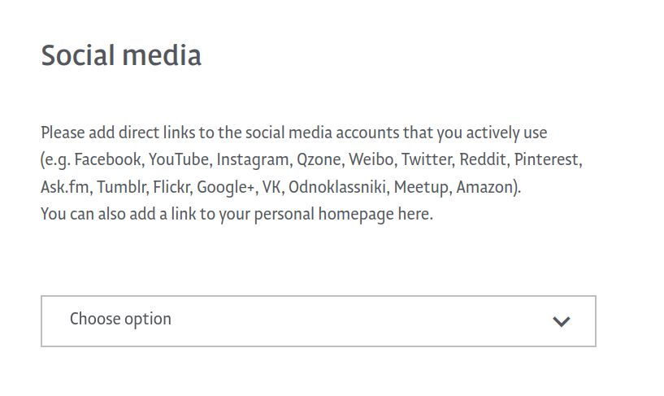
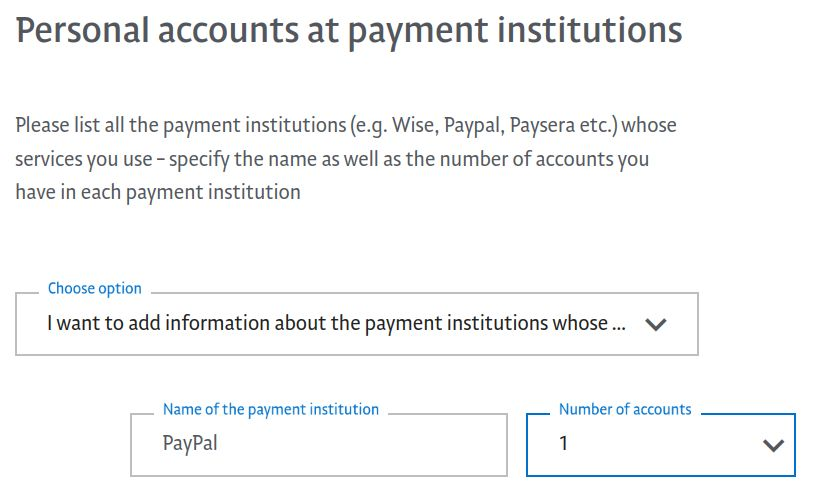
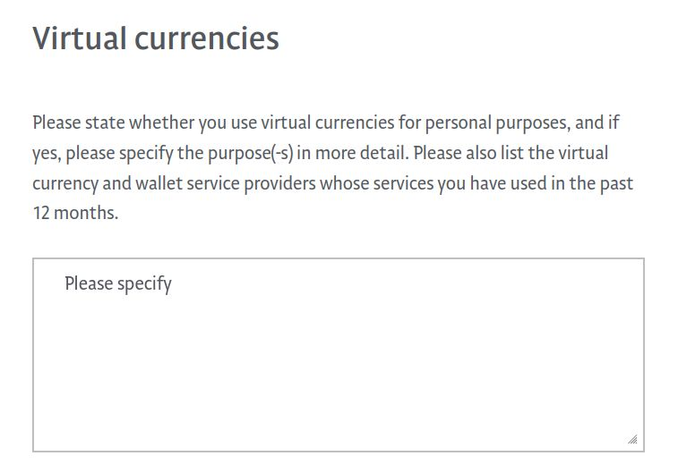

As my stay in Tartu goes to an end I finally wanted to try to become an #eresident of #Estonia to stay connected to the country.

Well, here is the process and how it turned out eventually...

... why did I want to try? Besides hearing and experiencing some examples of digital government in academia, life didnt seem much different up here. Most interestingly: I had to wait 2 h in a room for someone to copy my personal information previously written on paper to get my personal ID (even short term students need this). So I thought maybe I have to take another step to unlock the full potential.

... to get the true experience I started my journey at https://www.e-resident.gov.ee/ and didnt read up on the topic before. Besides the promise that it will take me 30 min and that #Estonia has the world record in fastest company incorporation (15 min) - the whole process took me 1h 39min 32s (wasnt hunting any world record).

... mainly I was explaining what connects me to the country and motivates me to get the #eresidency . Scoring points in the Estonian People's basketball league - writing a report about yet to come mobile voting - taking a #kaggle challenge on open museum data and striving for implementation.

... finally we came to the spicy questions about social media, payment providers and crypto (images below) that were kind of difficult to answer as "No, I dont use such thing" would be an obvious lie. But still this felt too personal to tell to a state and contradictory to the idea of virtual currencies. [#Estonia follow me @tillwenke ;)]

... the 20€ for pick-up at the embassy in Berlin (only one in Germany) were okay for me.

... at the end there were some boxes to check - one mentioning a "state fee" that couldnt be refunded. Reading up on this the actual costs are 100€ (https://www.politsei.ee/en/instructions/e-resident-s-digital-id/how-much-and-how-to-pay). What a surprise at the end of my journey - this just felt like online shopping with unexpected shipping costs - currently that is not worth the money for me and I wonder if this excludes the people who might make most use of #eresidency (indeed there was a special program for Ukrainian citizens) and if this is a good state income stream with +100k #eresidents - Good Bye Estonia!

Final thought: the fee might not hurt that much as an entrepreneur who want to kick-start their company here. But with 1 to 2 months time to finally receive your #eresidency I imagine you might get it done in your own country as well. Nevertheless access to the European business environment can be of value for many founders around the globe.

